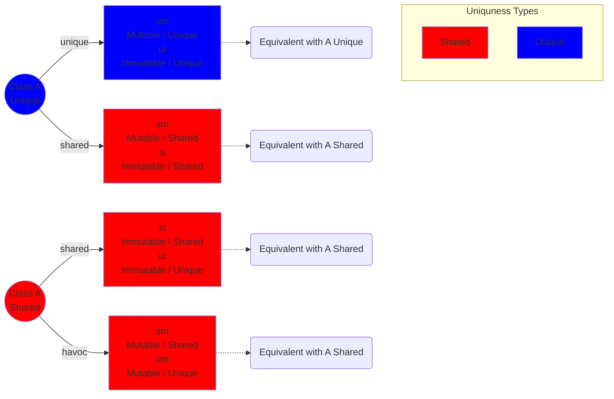

# Folding/Unfolding

## Identify Necessary Actions to Access a Path

Deciding what needs to be unfolded can be quite involved. We construct a recursive class such that every possible order of field accesses is possible. We ignore the fact that this data structure is infinite.

```Kotlin

class A(  
    @Unique var um : A,  
    @Unique val ui : A,  
    var sm : A,  
    val si : A  
)
```
We use the following abbreviations:

* um: Unique and Mutable  
* ui: Unique and Immutable  
* sm: Shared and Mutable  
* si: Shared and Immutable

### Visualization

The diagram should be read as follows:

* The color of the nodes is the result of the uniqueness type system.  
* Circles represent objects, while rectangles represent the fields of those objects.  
* The Uniqueness Type text inside a box is the declared uniqueness type of that field.  
* An arrow from ``object -action-> field`` indicates the `action` required to access that `field` on the `object`.  
* To access a deeper field, follow the arrows and execute the actions in the order of traversal.  
* To prevent the diagram from becoming too large, we use dotted arrows to indicate that we have reached a state equivalent to one already seen.



#### Mealy State Machine

The process of determining necessary actions can be expressed as a Mealy state machine. The input is the accessed path. The action unfold means that we need to unfold the path read so far (excluding the field responsible for the transmission). The first transmission is performed according to the uniqueness of the receiver.


(Due to an issue with the rendering engine, extra nodes were inserted in the diagram above.)

## Takeaways

* If the receiver is shared, we will never unfold a unique predicate. This is convenient because shared predicates do not need to be folded back.  
* All unique predicates that require unfolding are always at the beginning of the path. It is impossible for a single path to have an unfolding pattern like: *unfold-Unique ... unfold-Shared ... unfold-Unique*.

## When to Add the Fold/Unfold Statements

In this section, we evaluate where in the translation pipeline (from Kotlin to Viper) the unfold/fold statements should be added.

Unique and shared predicates cannot be unfolded at the same location in the pipeline. The following example illustrates this:

The fundamental difference between shared and unique predicates is that a shared predicate can be unfolded multiple times. Therefore, shared predicates can be unfolded during field access at the ExpEmbedding level. For unique predicates, this is not possible.

Assume everything is unique. Consider these two snippets:

```Kotlin
// Snippet 1  
var b = (root.left == null)

// Snippet 2  
var tmp = root.left
```

In the first snippet, we want to unfold unique(root) once and then fold it back. In the second, we only want to unfold unique(root) because root.left is moved to tmp.

To know whether a predicate must be folded back, we must determine if it is moved after the access. This information comes from the CFG flow analysis. To use it here, we must translate the flow analysis information first into the FIR AST and then into the ExpEmbeddings.

The mapping from FIR elements to CFG nodes is one-to-many. If we reverse this mapping and store the first and last nodes for each FIR element, we can determine which paths are moved or owned before and after each element. The problem arises when a path becomes moved: in the second snippet, root.left does not become moved after the root.left FIR element, but only after the assignment. This is logical: reading does not move an object; the assignment does.

Conclusion: We cannot unfold unique predicates at the field access level because, while the first snippet requires a subsequent fold, the second does not. The information available at the ExpEmbedding level in the field access is identical for both.

## Unfolding Strategy

The unfolding strategy is divided into two parts: Shared Unfolding and Unique Unfolding.

### Shared Unfolding Strategy

This covers all field accesses that require either a shared predicate or a havoc call. These potential unfolds can be inserted at the field access level. This cannot be performed earlier because if the path traversal contains a havoc call, the result is stored in an anonymous variable. This variable is only known once the call is inserted. Thus, the unfolding of shared predicates resulting from a havoc call must happen at the field access level.

### Unique Unfolding Strategy

This covers all unique predicate unfolds and is performed at the statement level. At this level, the following occurs:

1. Extract all "used paths."  
2. Use the uniqueness analysis results and the Mealy FSM to associate each field access with an action.  
3. Extract all prefixes containing only Unfold-Unique actions.  
4. Filter for uniqueness and order them by length.  
5. Insert the unfold statements.

## Unique Folding Strategy

In the folding strategy, we only need to consider unique predicates. Shared predicates are unfolded with wildcard permissions, meaning we retain access to the predicate. This works closely with the Unique Unfolding strategy:

1. Identify all used paths.  
2. Extract all prefixes that are unique and not partially moved.  
3. Order these prefixes by length, starting with the longest.  
4. Add fold statements for the corresponding unique predicates.

## Unique Folding Strategy on ExpEmbedding

The unique folding/unfolding strategy must be added to these ExpEmbedding types:

* `Declare`, `Assign`, `FieldModification`, `MethodCall`, `Return`.  
* `If`: Only the condition needs management. The bodies consist of ExpEmbeddings that handle their own unfolding. Permissions must be unfolded and then folded back before entering branches (or folded at the start of each branch).  
* `While`: Similar to If, with the additional need for invariant extraction.  
* `Elvis`: Treated similarly to If.

### Invariant Extraction

We focus on which unique predicates must be carried over the loop. We compare the uniqueness analysis results from four points: before the loop, at the start of the body, at the end of the body, and after the loop. We then identify all shortest unique, non-partially moved paths; these corresponding unique predicates must be added to the loop invariant.
