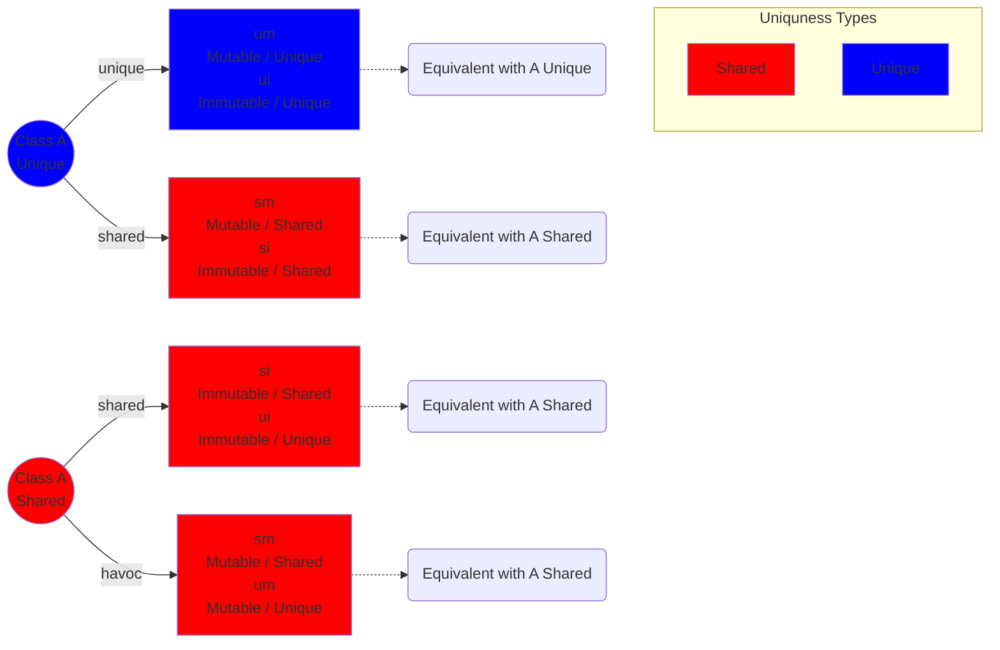
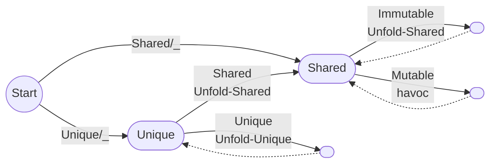

# Folding/Unfolding

## Identify Necessary Actions to Access a Path
Deciding what has to be unfolded can be quite involved. We construct a recursive class such that every possible order of field accesses are possible. We ignore that this datastructure is infinite. 

```kotlin
class A(
    @Unique  var um : A,
    @Unique val ui : A,
    var sm : A,
    val si : A
)
```

We use the following abbreviations:
- um: Unique and Mutable
- ui: Unique and Immutable
- sm: Shared and Mutable
- si: Shared and Immutable


### Visualization
This is how the diagram should be read:
- The color of the nodes is the result of the uniquness type system.
- The circles represent objects, while the rectangles represent the fields of the object.
- The Uniqueness Type text inside the box, is the declared uniqueness type of the field.
- The arrow from `object -action-> field`, means what action needs to be performed to access `field` on `object`.
- To access a deeper field, follow the arrows and execute the actions in the order of traversal.
- To not let the diagram explode we use dotted arrows, to indicate that we reached a situation which is equivalent to an already seen one.




#### Mealy State Machine
The way to get the necessary actions can be expressed as a Mealy state machine. The input is the accessed path. The action `unfold` mean, that we need to unfold the path that was read so far (without the field that is responsible for the transmission). Thi first transmission is performed according to the uniquness of the receiver.



(Due to an issue with the rendering engine, useless nodes were inserted)

## Takeaways
- If the reciever is shared, we will never unfold a unique predicate. This is convienient, because the shared predicates do not need to be folded back.
- All the unique predicates that need to be unfolded are always in the beginning of the path. It can not happen that for a single path we have a unfolding pattern like this: unfold-Unique ... unfold-Shared ... unfold-Unique


## When to add the Fold/Unfolds Statements
In this section we evaluate where in the translation pipeline from Kotlin to Viper the unfold/fold statements should be added.

The unique and shared predicates can not be unfolded at the same location in the translation pipeline. The following example illustrates this:

The fundamental difference between the shared and unique predicate is, that the shared can be unfolded multiple many times. Therefore for shared predicates we can unfold them on the field access on the `ExpEmbedding` level. For the unique predicates this is not possible. Assume that everything is unique. We provide two code snippets:
```kotlin
// first
var b = (root.left == null)

// second
var tmp = root.left
```
In the first snippet we want to unfold `unique(root)` once and the fold it back. In the second snippet we only want to unfold `unique(root)` (because `root.left` is moved to tmp).
To know wheather the predicate must be fold back, we need to know if after the access it is moved or not. This information comes from the CFG flow analysis. To be able to use them here we need to translate the flow analysis information first into the fir AST and then into the `ExpEmbeddings`. The mapping from fir Elements to CFG nodes is one to many. If we reverse the this mapping and store the first and last node for each fir Element, we will know which paths are moved/owned before and after each fir Element. The problem is when a path becomes moved. In the second snipped `root.left` does not mecome moved after the `root.left` fir element but only after the assignment. This makes sense, because the reading does not move an object, the assignment does.

The conclusion is, that we can not unfold the unique predicates on the field access level, because in the first snippet we are suppost to fold it back afterwards, whereas in the second we are not. However the information available on the field access in the `ExpEmbedding` level is the same for each snippet.

# Unfolding Strategy

The unfolding strategy is divided into two parts: The **Shared Unfolding** part and the **Unique Unfolding** part.

## Shared Unfolding
This contains all the field accesses that either require the shared predicate or a havoc call. This potential unfolds can be inserted on the field access level. Also it is not possible to perform this earlier. Because if the traversal of the path contains a havoc call, the result will be stored in a anonyous variable. This variable will only be known, once the call is inserted. So the unfold of shared predicates, where the shared predicate comes from the havoc call, must be inserted on the field access level. So it is easier to insert all the shared predicates unfolding on the level fo the field access in the `ExpEmbedding`. 

## Unique Unfolding
This contains all the unique predicate unfolds. This will be performed on the statement level. On the statement level the following is done:
1. Extract all the used paths (we refer to them as "used paths")
2. Use the result of the uniqueness analysis and the Mearly FSM to associate each field access of each used path with an action.
3. Extract all the prefixes which contain only `Unfold-Unique` actions.
4. Make them unique and order them according to their length
5. Insert the unfold statements.


# Unique Folding Strategy

In the folding strategy we only need to consider unique predicates. Because the shared predicates are unfodled with wildcard permission, which means we still have access to the predicate.
The folding strategy works closely together with the Unique Unfolding strategy.
1. Get all the used paths
2. Extract all the prefixes which are unique and not partially moved
3. Order the prefixes by their length starting with the longest.
4. Add fold statements for the corresponding unique predicate.


# Unique Folding Strategy on ExpEmbedding

The unique folding/unfolding strategy must be added to this `ExpEmbedding`s:
- `Declare`
- `Assign`
- `FieldModification`
- `If` - Here especially the condition is important. The permissions must be unfolded and then folded back before entering the branches. Another option is that the folds happen in the beginning of each branch. If the else branch does not exists, it must be added to include the necessary fold statements.
- `While` - Similar challenge as the `If` with additional need for invariant extractions. 
- `MethodCall`
- `Elvis` - Similar to the `If`
- `Return` - The fold (if they even can exist) must be placed before the viper `goto`. 


## Invariant Extraction

We focus here on which unique predicates must be carried over the loop. For this we need the result of the uniqueness analysis from before the loop, at the beginning of the loop body, at the end of the loop body, and after the loop. From all these results we need to identify all the shortest unique and not partially moved paths. The corresponding unique predicates must be added to the loop invariant.  
