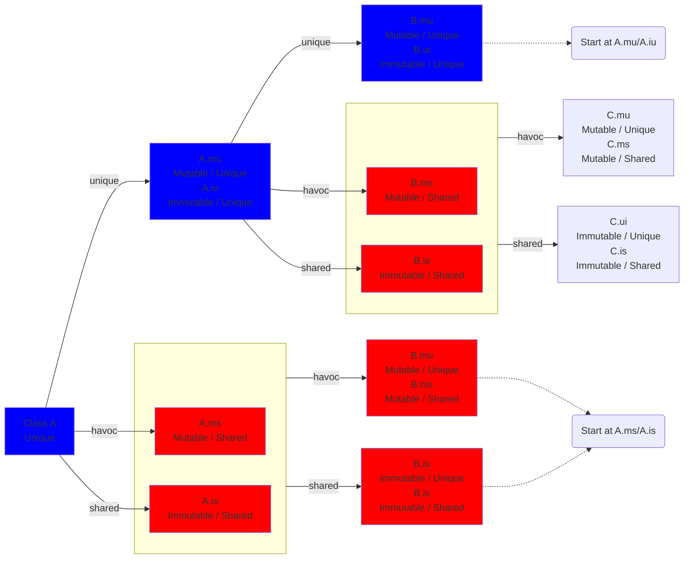

# Predicates folding/unfolding

## Expected Behaviour




## Prerequisites
- To unfold and fold correctly, we need information from the uniqueness checker. This includes:
  - Knowing if the receiver of field access is shared or unique.
  - For a given path, is the corresponding object partially moved.


## General Remarks
- The main problem is to know when to keep a unique-predicate unfolded and when to fold it back.
- This is less problematic for shared predicates since folding back is not necessary.
- The Kt-to-Viper encoding should be done only if the program is well-typed according to our annotation system.
- Thanks to the annotation system, we know that when something is passed to a function expecting a unique argument, it
  must be in std form. This means that all the sup-paths have at least default permissions.
- The rule of thumb should be: if a reference is unique at some point in the annotation system, at the corresponding
  point of the Viper encoding its unique-predicate should hold, or we should be able to obtain it after applying some
  fold/unfold. 

## Fields
Folding is closely related to field access. Therefore, we provide an overview of all possible field accesses.

| Receiver - R | Field - F | Mutable | Access Policy          | Reading        | Writing     |
|--------------|-----------|---------|------------------------|----------------|-------------|
| unique       | unique    | val     | ALWAYS_READABLE        | res := R.F     | not allowed |
| unique       | unique    | var     | BY_RECEIVER_UNIQUENESS | res := R.F     | R.F := res  |
| unique       | shared    | val     | ALWAYS_READABLE        | res := R.F     | not allowed |
| unique       | shared    | var     | BY_RECEIVER_UNIQUENESS | res := havoc() | removed     |
| shared       | unique    | val     | ALWAYS_READABLE        | res := R.F     | not allowed |
| shared       | unique    | var     | BY_RECEIVER_UNIQUENESS | res := havoc() | removed     |
| shared       | shared    | val     | ALWAYS_READABLE        | res := R.F     | not allowed |
| shared       | shared    | var     | BY_RECEIVER_UNIQUENESS | res := havoc() | removed     |

** for writing, when we write "removed" we mean that the write to the field itself is removed however potential side 
effects of such a write are preserved.


We will now go through every access policy and explain the corresponding folding mechanimss.

### ALWAYS_READABLE
These are all immutable fields. Hence, we only need to consider reading such fields.

To read, the shared predicate of the receiver must be unfolded. We do not need to fold it back, because we unfold with
wildcard permission and can therefore unfolding as many times as we want.

### BY_RECEIVER_UNIQUENESS
These are the fields that are mutable. The state of the receiver is important.

**Case: Receiver is Shared**

Reading: No predicate must be unfolded. The value always comes from a havoc method.
Writing: No predicate must be unfolded. The writing is never performed.

**Case: Receiver is Unique**

Unclear if this is actually the case:
Both reading and writing are handled the same way. We need to handle this case earlier in the translation, because we
need to know the full accessed path. The necessary fold and unfolds are figured out during the translation to ``ExpEmbeddings`` 
or on a sperarate pass on the ``ExpEmbeddings``. We work on the level of statements. 

For every statement the following is performed:
1. extract the paths used in the statement. Using the results from the uniqueness checker, perform the following:
  - for every prefix of the path:
    - if the prefix is unique, keep it.
    - if the prefix is unique, except the last field, keep it.
    - otherwhise discard it
2. Remove the last field of each path and make them unique.
3. Order them increasing by the length of the path.
4. For every prefix of every path, check if the prefix is partially moved, otherwise add an unfold statement.

5. The actual statement is translated.

6. Find the written to path, remove the last field. Check for each prefix, starting from the longest:
  - If the prefix is not partially moved: add a fold statement for this path.
7. If there is no written to path, then fold everything unfolded before but in reversed order.


Note: the previous two steps could be combined by just do step 6 for every occurring path. 

Note:Method calls can be handled the same way as statements.


Branches:

For if-else branches the following procedure is performed
1. Extract the condition and consider it a statement. 
2. Step 6 is performed at the beginning of both branches. If there is no else branch, create an "empty branch"

Loops: 
- Loops are much more complicated. Especially when we have borrowed datastructures in the function.
- Loops are discussed in [another document](folding-unfolding-while.md)

#### Examples
Consider the following class. All the fields are mutable and unique and have the same type.
We assume that every accessed field is unique.
````
A
├── first
│   ├── first
│   │   ├── ..
│   │   └── ..
│   └── second
│       ├── ..
│       └── ..
└── second
    ├── first
    │   ├── ..
    │   └── ..
    └── second
        ├── ..
        └── ..
````
Example 1. Deep to Shallow
````kotlin
// partially moved: {}
// 1. extracted paths: {A.first.first}
// 2. without last: {A.first}
// 3. done
// 4. unfold (A), unfold (A.first)
var x = A.first.first // 5.
// 6. partially moved: {A.first}
// 8. done, 9. done

// continues

// partially moved: {A.first}
// 1. extract paths: {A.first}
// 2. without last: {A}
// 3. done
// 4. A is already unfolded (since A.first is partially moved)
A.first = x
// written to: A.first, without last: A
// partially moved: {}
// A is not partially moved anymore
fold(A)
````
Example 2
````kotlin
// partially moved: {}
// 1. extracted paths: {A.first.first}
// 2. without last: {A.first}
// 3. done
// 4. unfold (A), unfold (A.first)
var x = A.first.first // 5.
// 6. partially moved: {A.first}
// 8. done, 9. done

// continues

// partially moved: {A.first}
// 1. extract paths: {A.first, x.first}
// 2. without last: {A, x}
// 3. done
// 4. unfold (x)
A.first = x.first
// written to: A.first, without last: A
// partially moved: {x}
// A is not partially moved anymore
// fold(A)
````
Example 3
````kotlin
// partially moved: {}
// 1. extracted paths: {A.first.first}
// 2. without last: {A.first}
// 3. done
// 4. unfold(A) unfold(A.first)
A.first.first = A()
// written to: A.first.first, without last: A.first
// partially moved: none
fold(A.first)
fold(A)
````
Example 4
````kotlin
// partially moved: {}
// extracted path: A.first.first, without last: A.first, 
// unfold(A), unfold(A.first)
var x = a.first.first
// partially moved: A.first


// path: A.first.second, without last: A.first
// since A.first is partially moved, we do not need to unfold it.
var y = a.first.second
// partially moved: A.first
// no written to path

// path: A.first.first, without last: A.first, nothing to fold
// partially moved: a.first
a.first.first = A()
// written to: a.first.first, without last: a.first
// partially moved: A.first, nothing to fold


// path: A.first.second, without last: A.first, nothing to fold
a.first.second = y
// partially moved: none
// path: A.first.second, without last: A.first
// fold(A.first)
// fold(A)
````

LinkedList Example

The implementation does not focus on efficiency etc. It is just a simple example.
````kotlin

class Node(
  @Unique var next : Node?,
  var value: Int)


class LinkedList(
  @Unique var head: Node?
)

fun lengthRecursiveHelper(@Unique @Borrowed n : Node) : Int {
    // paths: n.next, without last: n, unfold(n)
  if (n.next == null) { 
      // fold(n)
    return 1
  } else {
    // written to path: none
    // fold(n)
    
      // paths: n.next, without last: n, unfold(n)
    return lengthRecursiveHelper(n.next) + 1
    // written to none
    // method call, n.next was borrowed, so reverse the unfolds
    // partially moved: none
    // fold(n)
  }
}


fun lengthRecursive(@Unique @Borrowed l : LinkedList) : Int {
    // paths l.head, without last: l, unfold(l)
  if (l.head == null) {
      // extracted paths: l.head, without last: l
      // partially moved: none
      // fold(l)
    return 0
  } else {
      // extracted paths: l.head, without last: l
      // partially moved: none
      // fold(l)
      
      // paths l.head, without last: l, unfold(l)
      return lengthRecursiveHelper(l.head)
      // partially moved: none
      // fold(l)
  }
}


fun insert(@Unique @Borrowed l : LinkedList, value : Int) {
  // no path
  @Unique var newNode = Node(null, value)
    
    
  // paths: newNode.next, l.head without last: newNode, l, unfold(newNode), unfold(l)
  newNode.next = l.head
  // partially moved: l
  // fold(newNode)
  
  // paths l.head, without last: l
  // partially moved: l
  l.head = newNode
  // partially moved: none
  // fold(l)
}

// same as `insert`
fun insertNode(@Unique @Borrowed l : LinkedList, @Unique node: Node) {
  node.next = l.head
  l.head = node
}


fun insertSecond(@Unique @Borrowed l : LinkedList, value : Int) { 
  // not paths
  @Unique var newNode = Node(null, value)
    
  // paths: l.head, without last: l
  // partially moved: none
  // unfold(l)
  var firstNode = l.head
  // partially moved: l
  // noting to fold.
    
  // no paths
  if (firstNode == null) {
    
      // partially moved: l
      // paths: l.head, without last: l, already unfolded
      l.head = newNode
      // extracted paths: l.head, without last: l
      // partially moved: none
      // fold(l)
  } else {
    
      // partially moved: l
      // paths: firstNode.next, without last: firstNode
      // unfold(firstNode)
      var secondNode = firstNode.next
      // extracted paths: firstNode.next, without last: firstNode
      // partially moved: l, firstNode

      // extracted paths: newNode.next, without last: newNode
      // unfold (newNode)
      newNode.next = secondNode
      // extracted paths: newNode.next, without first: newNode
      // partially moved: l, firstNode
      // fold(newNode)
    
      // extracted paths: firstNode
      firstNode.next = newNode
      // extracted paths: firstNode.next, without first: firstNode
      // partially moved: l
      // fold(firstNode)


      // extracted path: l.head, without last: l
      // nothing to unfold, because l is partially moved
      l.head = firstNode
      // extracted paths: l.head, without last: l
      // partially moved: none
      // fold(l)
  }
}

fun insertLastRecursiveHelper(@Unique @Borrowed current : Node, @Unique node : Node) {
  if (current.next == null) {
    current.next = node
    return
  }
  insertLastRecursiveHelper(current.next, node)
}

fun insertLastRecursive(@Unique @Borrowed l : LinkedList, @Unique node : Node) {
  @Unique var current = l.head
  if (current == null) {
    l.head = current
    insertNode(l, node)
    return
  }
  insertLastRecursiveHelper(current, node)
  l.head = current
}


@Unique
fun popFirst(@Unique @Borrowed l: LinkedList) : Node? {
  // extracted paths: l.head, without last: l
  // unfold(l)
  @Unique var result = l.head
  // partially moved: l
  
  // no extracted paths
  if (result == null) {

    // extracted paths: l.head, without last: l
    // partially moved: l
    l.head = result // necessary since l is borrowed.
    // partially moved: none
    // fold(l)
    return null
  }
  // extracted paths: l.head, result.next, without last: l, result
  // partially moved: l
  // unfold(result)
  l.head = result.next
  // partially moved: result.next
  //fold(l)
  
  // extracted path: result.next, without last: result
  // unfolded: result
  result.next = null
  // written to path: result.next, without last: result
  // partially moved: none
  // fold(result)
  return result
}

fun reverse(@Unique @Borrowed l: LinkedList) {
  // extracted paths: none
  val currentHead = popFirst(l)
  // extracted paths: none
  if (currentHead == null) {
    return
  }
  // extracted paths: none
  reverse(l)
  // extracted paths: none
  insertLast(l, currentHead)
}
````

#### Remarks
- We do not need to bother with method calls. Because the uniqueness checker will make sure that we are allowed to call that method.
So, if a method expects a unique argument, the corresponding object cannot be partially moved; hence we must already have the predicate.
- If a part of an object is borrowed, then we will see it in the path and unfold it. After the function call, the uniqueness checker
will inform the folder that it is no longer moved. Hence, we will fold it back.
