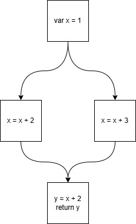

# Converting an ExpEmbedding into SSA form

In order to translate pure Kotlin functions into Viper functions their body must
be translated into a single expression. Therefore, reassignments of variables may
not happen on the Viper level which is why the ExpEmbedding must be translated
into SSA form.

## Converting a Block to SSA form

Assuming we have a block embedding with no branching (branching in the CFG that
is), converting into SSA form is quite straight-forward:
- Traverse the ExpressionEmbeddings in the block in order
- As soon as a reassignment is found introduce a new variable and assign it the
  RHS of the reassignment.
- In subsequent usages of the 'original' variable use the newly introduced
  version.
In code this may look like the following:
```kotlin
var x = 1
x = x + 1
return x
```
translates to:
```viper
let x_0 == (1) in
let x_1 == (x_0 + 1) in
x_1
```
Note: An optimized encoding of the above example could be created by assigning
1 + 1 directly to x_0. In general, if no usages occur between two reassignments
of the same variable we can omit one assignment.

To implement the above algorithm we need to introduce some state tracking the
assignments of a variable: Then when encountering a variable usage in our block
we have two options:

1. If the variable is a LHS of an assignment update the variable state to carry
   the RHS as the new 'latest' version of the variable
2. Otherwise use the latest version of the variable

We introduce those additional variables on the Viper AST level. That is the
ExpEmbeddings continue to contain the original variable value and we inject the
'latest' SSA version upon translation.

## What about branching?

To convert an arbitrary program into SSA form, we will adhere to the following conversion algorithm:

https://dl.acm.org/doi/10.1145/115372.115320

The key idea is the following: Whenever a join in the control flow graph (CFG)
of the program is encountered and if it is necessary, a $\Phi$ function is
assigned to the next 'version' of a variable. This $\Phi$ function selects the
correct upstream (upstream in the CFG that is) value of the variable based on
the execution path taken to reach that block. The efficient identification of
necessary locations for $\Phi$ functions is determined using dominance frontiers,
ensuring they are only inserted where distinct definitions actually collide. The
dominance frontier of a node d is the set of nodes that are not strictly
dominated by d, but have an immediate predecessor that is. A node $d$ strictly
dominates another node $d'$ if all paths to $d'$ in the CFG go through $d$.
Consider the following program:

```kotlin
var x = 0
if (x == 1) {
    x = x + 2
} else {
    x = x + 3
}
val y = x
return y
```

To understand the above described algorithm better, let's take a look at the CFG
of the above example: 



Let's analyse the dominance frontiers $DF$ in this graph:

- $DF(A)$ = $\emptyset$ - as A strictly dominates every other node
- $DF(B)$ = $\{D\}$ - as you can reach D via C
- $DF(C)$ = $\{D\}$ - as you can reach D via B
- $DF(D)$ = $\emptyset$ - as D does not dominate any nodes (as it has no child)

Therefore, a $\Phi$ selecting the correct upstream value must be inserted at node
$D$. As the correct upstream value to be selected is determined by the result of
an if-statement a ternary operator will suffice as the $\Phi$ function here

Overall, this program translates to:
```viper
let x_0 == (0) in
let x_1 == (x_0 + 2) in
let x_2 == (x_0 + 3) in
let y_0 == ((x_0 == 1) ? x_1 : x_2) in
y_0
```

Implementation note: To perform this translation two things are required:
- A CFG topology (can be derived from the ExpEmbedding structure)
- A map between variable definitions and the blocks they occur in 