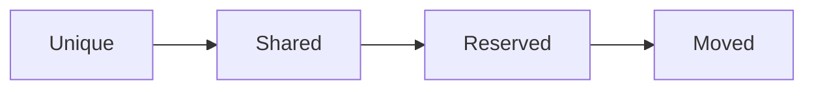
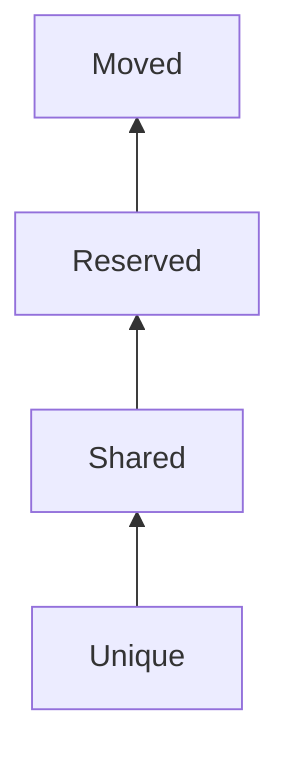
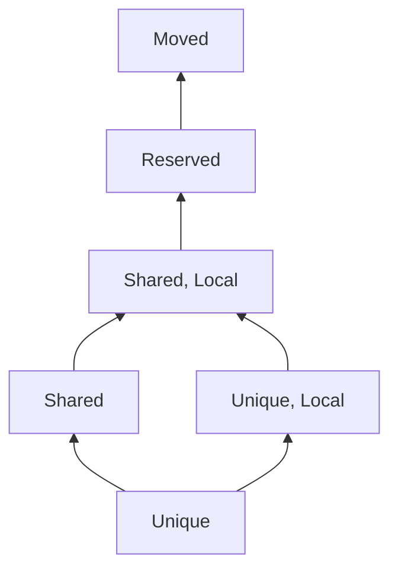
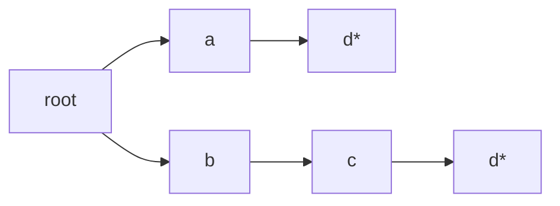
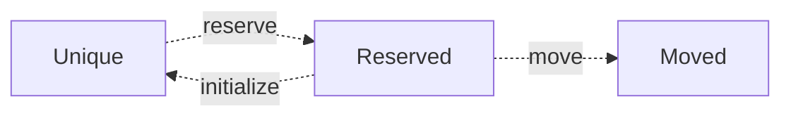
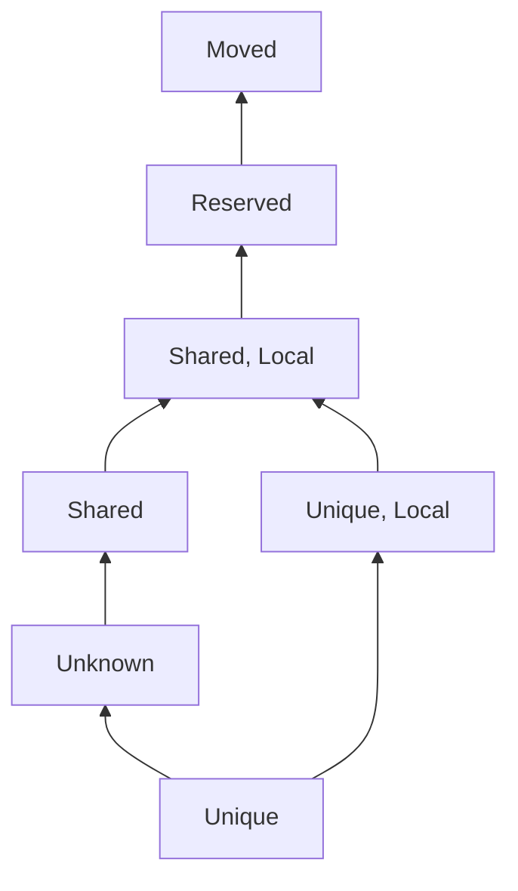

# Summary of Uniqueness Analysis

This document describes the current uniqueness *analysis* in the compiler
plugin. Here we focus specifically on state construction and propagation, rather
than on the checking.

## Domain of the Analysis

The analysis tracks `Uniqueness` values on paths (chains of field dereferences):

- `Unique` denotes a path that has not been aliased.
- `Shared` denotes a path that can be shared.
- `Reserved` denotes a unique path that is bound to be consumed.
- `Moved` denotes a unique path that has been consumed and can no longer be
  used.

The implementation order is:



Operationally:

- `join = max` in this order
- `meet = min` in this order
- `required.accepts(actual)` is `required >= actual`

`Unique` and `Shared` are declaration-level defaults (`@Unique` vs no
uniqueness attribute). `Reserved` and `Moved` are analysis states produced
during the analysis.

## Analysis Models

Here we summarize some of the basic components used by the anaylsis.

### Paths

A path is a list of FIR symbols (`Path = List<FirBasedSymbol<*>>`), such as
`a.first.next`.

### `AccessState`

### The `Uniqueness` Lattice

Uniqueness is currently represented by the elements in the following lattice:



When using the uniqueness checker together with the locality checker, the full
lattice becomes:



As we discuss below this model might be incomplete as we may need a separate
state for tracking the uniqueness of a field of a `Shared, Local` reference.

### The `AccessState` Model

An `AccessState` is an immutable path-trie datastructure `PathTrie<Access>`,
where `Access` is:

- `Intermediate` if the node is only a path component
- `Terminal` if the node represents the end of a path

This model is used to extract which paths are being accessed by a given
expression.

Note that the leaves of an access state are always marked as `Terminal`s, but
intermediate components can also be labeled as `Terminal` i.e.  if an access
includes both a path and its subpath (e.g. x.y and x.y.z).

### The `UniquenessState` Model

Like `AccessState`, the `UniquenessState` is also a path trie which for every
path component, stores the corresponding uniqueness value sitting somewhere in
the uniqueness lattice. To change the `UniquenessState` we make use of the
following functions provided by the `AccessState` model:

- `AccessState.initialize(UniquenessState)`: Yields a new uniqueness state
  where the paths in the `AccessState` are assigned to their default uniqueness
  values. Note that the default uniqueness of a path component is always joined
  with that of the parent. For example if a path `a.x` is nominally `Unique`
  and `a` is nominally `Shared` `a.x` is stored as `Shared` as well.
- `AccessState.reserve(UniquenessState)`: Yields a new uniqueness state where
  the paths in the `AccessState` are marked as `Reserved`.
- `AccessState.move(UniquenessState)`: Yields a new uniqueness state where the
  paths in the `AccessState` that were previously marked as `Reserved` are
  marked as `Moved`
  
#### Extracting `AccessState` from Expressions

`ExpressionAccessStateResolver` computes accessed paths from expressions.

- Qualified variable/property access adds the selected symbol, optionally
  appended to receiver paths.
- Safe calls (`a?.b`) use selector access state.
- `as`/`as?` casts are stripped before analysis.
- Conditionals (`when`, elvis, `try/catch`, block tail) are resolved by joining
  tails via `UnifyingExpressionTypeResolver`.

This gives a conservative union of paths that may be accessed by an expression.

This can be used to retrieve an access state for arbitrarely nested and
branching expressions, for example the access state for:
```
(if (foo()) { a } else { b.c }).d
```

is the following (Terminal nodes are marked with "\*"):


## Analysis Transitions

The effective state transitions performed by the uniqueness analysis over the
uniqueness lattice can be summarized as:



Where:

- *reserve* is applied when accesses are marked for potential consumption.
- *move* is applied when those reserved accesses are consumed.
- *initialize* restores declared uniqueness on specific paths (for example,
  when values are re-bound or when local-call arguments are restored at call
  exit).
  
In addition to these operations, it is also possible to *rebase* a uniqueness
substate onto another. Consider the following example in which we try to rebase 

```
graph TB
    subgraph After
       root1["root"] --> a2
       root1 --> b4
        a2["a"] --> b3["b: Unique"]
        b3 --> c3["c: Moved"]
        a2 --> d2["d: Reserved"]
        b4["b"] --> c4["c: Unique"]
        c4 --> c5["c: Moved"]
    end

    subgraph Before
       root2["root"] --> a1
       root2 --> b2
        a1["a"] --> b1["b: Unique"]
        b1 --> c1["c: Moved"]
        a1 --> d1["d: Reserved"]
        b2["b"] --> c2["c: Unique"]
    end
```

For the different CFG node types the transitions are then computed as follows:

- `QualifiedAccessNode` (any variable reference):
  - *initialize* path receiver (for property accesses with backing field receiver)
  - *reserve* selector access paths
- `ExitSafeCallNode` (field accesses with `?.`):
  - *reserve* selector access paths
  - *initialize* receiver access paths
- `VariableDeclarationNode` with initializer:
  - if initializer is not present, *initialize* left path, else *rebase* the
    initializer's uniqueness substates onto the declared variable path
  - *move* right access paths
- `VariableAssignmentNode`:
  - if lhs resolves to exactly one terminal path, *rebase* the rhs uniqueness
    substate onto the path on the lhs
  - *initialize* receiver of the lhs (if the assignment targets a qualified lhs)
  - *initialize* lhs access path
  - *move* rhs access paths
- `FunctionCallEnterNode`:
  - *move* all receiver and argument access paths
- `FunctionCallExitNode`:
  - *initialize* arguments whose parameter locality is local. We can do this
     because we know that passing the argument has local doesn't change its
     uniqueness.
- Synthetic call-like nodes (`==`, non-cast type operators):
  - *initialize* argument paths. This should be possible because none of these
    operations should change uniqueness.

For all of the other node types the analysis does not alter the incoming state.

## What is Currently Missing

Currently the analyzer cannot reason about the uniqueness state of nominally
`Unique` fields of `Shared, Local` references. These fields must exibit the
following characteristics:

- They may be moved like unique fields.
- They can accept unique references.
- They can't conform to unique.
- They can conform to shared.

These characteristics seem to define another uniqueness state that sits
somewhere between `Unique` and `Shared`. In the following diagram we attempt to
define this state as `Unknown`:

